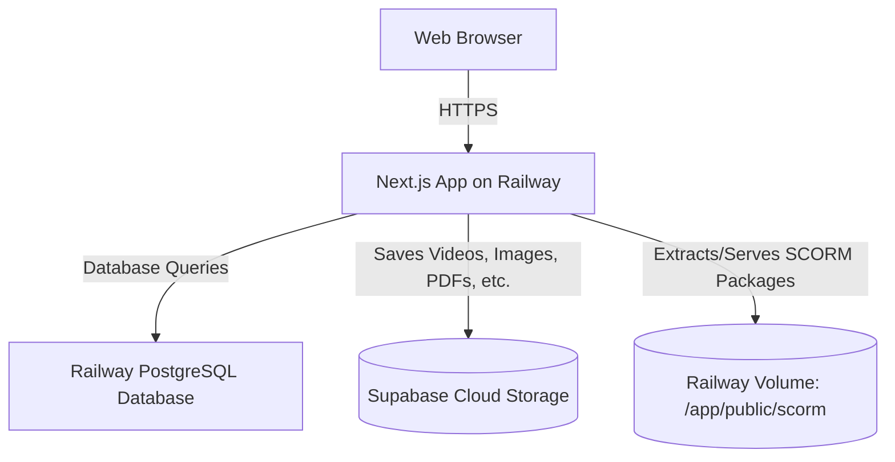

# CPDHub Production Deployment Guide (Railway & Supabase)

This guide provides step-by-step instructions to host **CPDHub** on [Railway](https://railway.app) in a secure, stable, and highly performant production environment, backed by **Supabase Storage** for your uploads.

It details how to configure **cloud databases** (PostgreSQL), **Supabase Storage** (for videos, images, PDFs, etc.), and **persistent storage volumes** (specifically for SCORM course packages) so that your application runs smoothly without relying on local ephemeral server storage.

---

## Architecture Overview

On cloud platforms like Railway, standard server containers are **ephemeral**—meaning that any local files written directly to the server's disk are **wiped out** whenever the container restarts or redeploys.

To solve this, we use the following cloud architecture:


1. **Persistent Data (Database):** We have migrated the database provider from SQLite to **PostgreSQL**.
2. **Resource Uploads (Supabase Storage):** All course resources (Videos, Images, Presentations, PDFs, etc.) are uploaded **directly to Supabase Storage** from the server. They are stored securely and served globally via Supabase's CDN using permanent public URLs.
3. **SCORM Course Packages (Railway Volume):** Because SCORM packages are complex zipped HTML modules that need to run from the exact same domain to avoid Same-Origin browser blocks, they are extracted locally and saved on a **Railway Volume** mounted at `/app/public/scorm`. This allows them to function perfectly without CORS problems.

---

## Step 1: Push the Code to GitHub (Done)

The latest code with Supabase Storage integration and PostgreSQL configuration is available on your GitHub repository:
👉 [https://github.com/sizastartup-ai/cpdhub.git](https://github.com/sizastartup-ai/cpdhub.git)

---

## Step 2: Create a Railway Project

1. Log in to [Railway.app](https://railway.app).
2. Click **New Project** in the top right.
3. Select **Deploy from GitHub repo**.
4. Choose the `cpdhub` repository.
5. Click **Deploy Now**.
   > [!NOTE]
   > The initial deployment will start but may fail temporarily. This is normal because the database and environment variables are not yet configured.

---

## Step 3: Add PostgreSQL Database to Railway

1. Inside your Railway project dashboard, click **+ New** (or **Add Service**).
2. Select **Database** -> **Add PostgreSQL**.
3. Railway will provision a new high-performance PostgreSQL instance.
4. Click on the newly created **Postgres** service card, go to the **Variables** tab, and copy the **`DATABASE_URL`**.
5. Click on your **CPDHub Next.js Service** card, go to **Variables**, click **New Variable**, and add:
   - **Name:** `DATABASE_URL`
   - **Value:** Paste the connection string you copied.

---

## Step 4: Configure Supabase Cloud Storage

1. Create a free account at [Supabase.com](https://supabase.com) and create a new project (e.g. `cpdhub-storage`).
2. Once the project is provisioned, go to **Storage** from the left sidebar.
3. Click **New Bucket** and configure it:
   - **Name:** `resources` *(or a custom name)*
   - **Public:** Toggle this to **Enabled** (Public bucket is required so users can view/download resources).
   - Click **Save**.
4. Go to **Project Settings** (gear icon) -> **API** from the sidebar.
5. Retrieve your project connection details:
   - **Project URL:** Copy the URL (this is your `SUPABASE_URL`).
   - **service_role API key:** Click **Reveal** under `service_role` key and copy it (this is your secure server-side secret key `SUPABASE_SERVICE_ROLE_KEY`).
   > [!WARNING]
   > The `service_role` key can bypass Row Level Security. Never share it, expose it in frontend clients, or commit it to GitHub. It is completely safe to define as an environment variable in Railway.

---

## Step 5: Add Persistent Storage Volume for SCORM Packages

Since SCORM packages are zip files extracted locally into `/public/scorm`, we need to mount a persistent disk to this folder to ensure extracted modules survive server restarts.

1. Click on your **CPDHub Next.js Service** card.
2. Go to the **Settings** tab.
3. Scroll down to the **Volumes** section and click **+ Add Volume**.
4. Configure the volume:
   - **Name:** `scorm-volume`
   - **Mount Path:** `/app/public/scorm`
   - **Size:** Choose your preferred size (e.g., 5GB or 10GB).
5. Click **Create & Mount**.

---

## Step 6: Configure Environment Variables on Railway

Click on your **CPDHub Next.js Service**, navigate to the **Variables** tab, and define all variables required for your production app:

| Variable Name | Description / Recommended Value |
| :--- | :--- |
| `DATABASE_URL` | *Automatically linked from your Railway Postgres service* |
| `SUPABASE_URL` | Your Supabase project URL (e.g., `https://xyz.supabase.co`) |
| `SUPABASE_SERVICE_ROLE_KEY` | Your Supabase service role secret API key. |
| `SUPABASE_BUCKET_NAME` | Name of your public bucket. Defaults to `resources` if not specified. |
| `NEXTAUTH_SECRET` | A secure, random string (e.g. run `openssl rand -base64 32` or type a long random key) |
| `NEXT_PUBLIC_APP_URL` | Your production URL (e.g., `https://cpdhub.railway.app` or custom domain) |
| `NODE_ENV` | `production` |
| `JWT_SECRET` | A secure, random string used for session tokens. |

---

## Step 7: Setup and Seed the Database

Once the environment variables are active, we need to create the database tables and populate the seed data (e.g., the default Admin user, Professions, and sample courses).

You can easily run this from your local machine, pointing to the Railway production database:

1. Open your local `.env` file.
2. Temporarily replace your local `DATABASE_URL` with your **Railway Production PostgreSQL URL**.
3. In your terminal, run the following commands to create the database schema and insert the seed data:
   ```bash
   # 1. Sync the PostgreSQL schema with your Prisma models
   npx prisma db push

   # 2. Run the seed script to insert professions and default admin
   npx prisma db seed
   ```
4. Once completed, restore your local `DATABASE_URL` in your `.env` to point to your local development database.

> [!TIP]
> **Production Credentials created by Seeding:**
> - **Admin Username:** `admin@cpdhub.co.ke`
> - **Admin Password:** `admin123`
> *(Please log in and immediately change this password in the admin settings dashboard!)*

---

## Step 8: Final Deployment and Verification

1. Go back to your Railway project dashboard.
2. Click on the **CPDHub Next.js Service**.
3. Under the **Deployments** tab, select the latest commit and click **Redeploy**.
4. Under the **Settings** tab, scroll to **Environment** and click **Generate Domain** (or configure your own custom domain).
5. Open the generated URL in your browser, log in as the admin, and upload a resource (PDF, Video, etc.). Go to your Supabase dashboard to verify that it uploaded successfully!

---
*Created and configured by Antigravity AI.*
