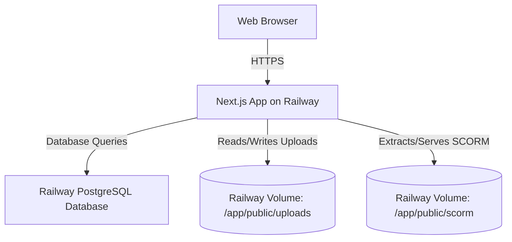

# CPDHub Production Deployment Guide (Railway)

This guide provides step-by-step instructions to host **CPDHub** on [Railway](https://railway.app) in a secure, stable, and highly performant production environment.

It details how to configure **cloud databases** (PostgreSQL) and **persistent storage volumes** so that your application runs smoothly without relying on local ephemeral server storage.

---

## Architecture Overview

On cloud platforms like Railway, standard server containers are **ephemeral**—meaning that any local files written directly to the server's disk (such as SQLite databases or uploaded PDF/SCORM files) are **wiped out** whenever the container restarts or redeploys.

To solve this, we use the following cloud architecture:


1. **Persistent Data (Database):** We have migrated the database provider from SQLite to **PostgreSQL**.
2. **Persistent Files (Uploads & SCORM):** We use **Railway Volumes** mounted at `/app/public/uploads` and `/app/public/scorm`. This allows us to store uploaded assets and extracted SCORM modules on a persistent SSD that survives redeployments, without requiring complex AWS S3 code rewrites that would trigger Same-Origin browser blocks on SCORM packages.

---

## Step 1: Push the Code to GitHub (Done)

The latest code with production configuration has already been successfully committed and pushed to your GitHub repository:
👉 [https://github.com/sizastartup-ai/cpdhub.git](https://github.com/sizastartup-ai/cpdhub.git)

---

## Step 2: Create a Railway Project

1. Log in to [Railway.app](https://railway.app).
2. Click **New Project** in the top right.
3. Select **Deploy from GitHub repo**.
4. Choose the `cpdhub` repository.
5. Click **Deploy Now**.
   > [!NOTE]
   > The initial deployment will start but may fail temporarily. This is normal because the database and environment variables are not yet configured.

---

## Step 3: Add PostgreSQL Database to Railway

1. Inside your Railway project dashboard, click **+ New** (or **Add Service**).
2. Select **Database** -> **Add PostgreSQL**.
3. Railway will provision a new high-performance PostgreSQL instance.
4. Click on the newly created **Postgres** service card, go to the **Variables** tab, and copy the **`DATABASE_URL`**.
5. Click on your **CPDHub Next.js Service** card, go to **Variables**, click **New Variable**, and add:
   - **Name:** `DATABASE_URL`
   - **Value:** Paste the connection string you copied.

---

## Step 4: Add Persistent Storage Volumes

Since uploads and SCORM packages write directly to the local filesystem (`/public/uploads` and `/public/scorm`), we need to mount persistent SSD disks to those directories.

1. Click on your **CPDHub Next.js Service** card.
2. Go to the **Settings** tab.
3. Scroll down to the **Volumes** section and click **+ Add Volume**.
4. Configure the first volume for standard resource uploads:
   - **Name:** `uploads-volume`
   - **Mount Path:** `/app/public/uploads`
   - **Size:** Choose your preferred size (e.g., 5GB or 10GB is usually plenty).
5. Click **Create & Mount**.
6. Create a second volume for SCORM course packages:
   - **Name:** `scorm-volume`
   - **Mount Path:** `/app/public/scorm`
   - **Size:** Choose your preferred size (e.g., 5GB or 10GB).
7. Click **Create & Mount**.

> [!IMPORTANT]
> Mounting these volumes ensures that all course PDFs, presentations, and extracted SCORM zip files remain safely saved on persistent storage. It also avoids CORS and Same-Origin issues because SCORM files are served from your app's direct domain (e.g., `/scorm/lesson-id/index.html`).

---

## Step 5: Configure Environment Variables

Click on your **CPDHub Next.js Service**, navigate to the **Variables** tab, and define all remaining variables required for your production app:

| Variable Name | Description / Recommended Value |
| :--- | :--- |
| `DATABASE_URL` | *Automatically linked from your Railway Postgres service* |
| `NEXTAUTH_SECRET` | A secure, random string (e.g. run `openssl rand -base64 32` or type a long random key) |
| `NEXT_PUBLIC_APP_URL` | Your production URL (e.g., `https://cpdhub.railway.app` or custom domain) |
| `NODE_ENV` | `production` |
| `JWT_SECRET` | A secure, random string used for session tokens. |

---

## Step 6: Setup and Seed the Database

Once the environment variables are active, we need to create the database tables and populate the seed data (e.g., the default Admin user, Professions, and sample courses).

You can easily run this from your local machine, pointing to the Railway production database:

1. Open your local `.env` file.
2. Temporarily replace your local `DATABASE_URL` with your **Railway Production PostgreSQL URL**.
3. In your terminal, run the following commands to create the database schema and insert the seed data:
   ```bash
   # 1. Sync the PostgreSQL schema with your Prisma models
   npx prisma db push

   # 2. Run the seed script to insert professions and default admin
   npx prisma db seed
   ```
4. Once completed, restore your local `DATABASE_URL` in your `.env` to point to your local development database if you wish to keep them separate.

> [!TIP]
> **Production Credentials created by Seeding:**
> - **Admin Username:** `admin@cpdhub.co.ke`
> - **Admin Password:** `admin123`
> *(Please log in and immediately change this password in the admin settings dashboard!)*

---

## Step 7: Final Deployment and Verification

1. Go back to your Railway project dashboard.
2. Click on the **CPDHub Next.js Service**.
3. Under the **Deployments** tab, select the latest commit and click **Redeploy**.
4. Under the **Settings** tab, scroll to **Environment** and click **Generate Domain** (or configure your own custom domain).
5. Open the generated URL in your browser, log in as the admin, and test your new production-grade platform!

---
*Created and configured by Antigravity AI.*
